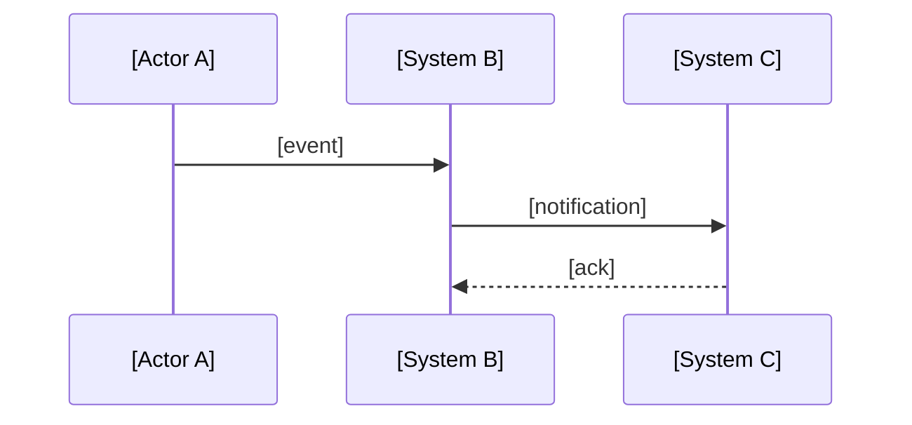

# After: [Name the architectural solution]

## What changed

[3-5 bullet points mapping each failure mode from `before/` to how it is fixed here.]

- **[Failure 1]** → [how fixed]
- **[Failure 2]** → [how fixed]

---

## Architecture diagram (target state)

---

## Key architectural decisions

### Decision 1: [Name]
**Options considered:** [A], [B], [C]  
**Chosen:** [A]  
**Reason:** [Why this option fits the constraints better]  
**Trade-off accepted:** [What you gave up]

### Decision 2: [Name]
**Options considered:** [A], [B]  
**Chosen:** [A]  
**Reason:** [Why]  
**Trade-off accepted:** [What you gave up]

---

## What this enables going forward

[Describe what becomes easy that was previously impossible or painful
like new providers, new event types, etc.]
