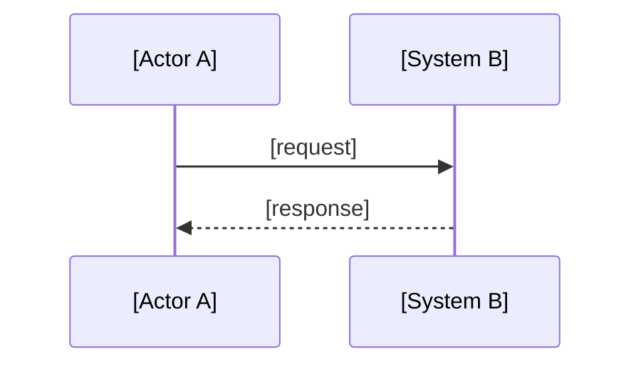

# Before: [Name the naive approach]

## What you are looking at

[Describe the current implementation in 2-3 sentences. What does it do? What technology?]

---

## Architecture diagram (current state)

---

## Failure modes to notice

| # | Failure | Why it hurts |
|---|---------|--------------|
| 1 | [Name]  | [Impact]     |
| 2 | [Name]  | [Impact]     |
| 3 | [Name]  | [Impact]     |

---

## Metrics of the problem

[Optional: latency numbers, wasted requests, coupling score, etc. Make the pain quantifiable.]

---

## Why you cannot simply add more code here

[One paragraph explaining why patching the current approach won't work, 
the structural reason it fails.]
