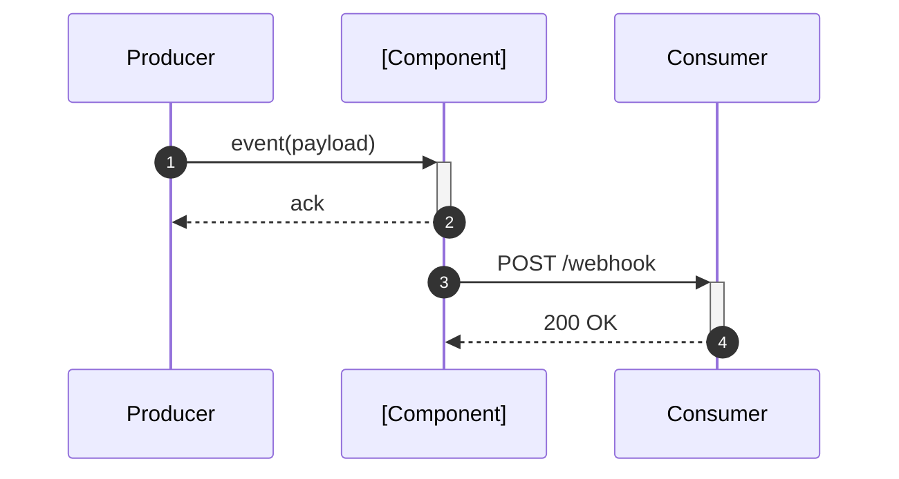
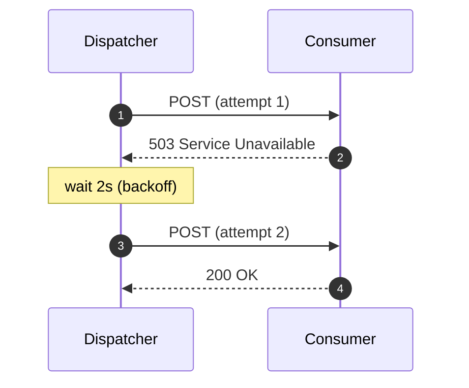
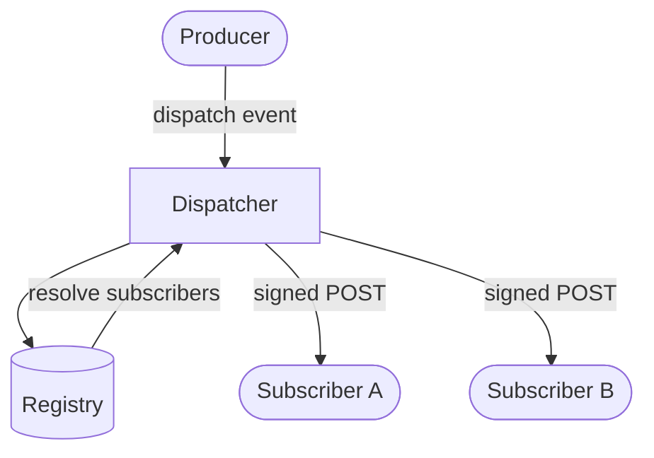

# Diagrams

All diagrams use **Mermaid** syntax — renders natively in GitHub, IntelliJ, VS Code (with the Mermaid plugin),
and most modern documentation tools.

---

## Flow 1: [Name — e.g. "Happy path"]

---

## Flow 2: [Name — e.g. "Retry on failure"]

---

## Component diagram

---

## Adding a new diagram

Copy one of the blocks above. Mermaid supports: `sequenceDiagram`, `graph`, `flowchart`, `erDiagram`,
`classDiagram`, `stateDiagram-v2`, `gantt`. Use the simplest type that communicates the idea.
