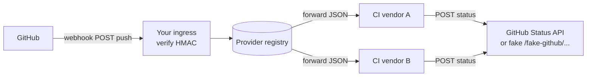

# Context: Webhooks across two industries

## Business scenarios

**Scenario A — Payment gateway (see `problem.md`, Part A).** Partners must learn about payment outcomes without
polling your API. Each partner exposes an HTTPS URL; your platform POSTs signed JSON when money moves.

**Scenario B — Dev platform (see `problem.md`, Part B).** A source host (GitHub, GitLab, Bitbucket) emits a
`push` event. One or more CI systems must start a pipeline for that commit, then report **commit status** back so the
UI shows green/red checks next to the SHA.

Both scenarios share the same architectural seam: **verified HTTP push** + **subscriber registry** + **idempotent
consumption** on the far side.

---

## Actors and boundaries

| Actor                    | Type                                           | Responsibility                                                                 |
|--------------------------|------------------------------------------------|--------------------------------------------------------------------------------|
| **Event producer**       | External (GitHub) or internal (Payment core)   | Emits facts: `push`, `payment.succeeded`, …                                    |
| **Ingress / dispatcher** | Your edge service                              | Verifies signatures, normalizes payload, fans out or routes                    |
| **Pipeline or partner**  | External SaaS (CircleCI, Jenkins, ShopFront)   | Accepts POST, runs work, may call **your** or **GitHub’s** REST API for status |
| **Status API**           | GitHub REST (or this workshop’s fake endpoint) | Stores check state on a commit SHA                                             |
| **Operator**             | Human                                          | Registers URLs and secrets; does not edit core payment or git ingestion code   |

---

## System boundaries

---

## Key constraints

- **Latency:** CI should start within seconds of the push; status should flip from `pending` to terminal quickly enough
  for developers not to reload endlessly.
- **Throughput:** GitHub can deliver bursts on large monorepos; ingress should ack fast and offload fan-out to a worker
  queue in real production.
- **Reliability:** At-least-once delivery is normal — CI and status endpoints must be **idempotent** per delivery id.
- **Security:** GitHub uses `X-Hub-Signature-256`; payment gateways often use `Stripe-Signature` or similar — always
  verify **raw body** bytes before parsing JSON.
- **Extensibility:** A new CI vendor only supplies an inbound URL (and optional signing secret) — no change to the
  core ingress binary.

---

## Data that flows

| Event / Message           | Source          | Destination                         | Payload shape                                                      |
|---------------------------|-----------------|-------------------------------------|--------------------------------------------------------------------|
| `push` webhook            | GitHub          | Your `/integrations/github/webhook` | GitHub JSON: `ref`, `repository.full_name`, `head_commit.id`, …    |
| Forwarded push            | Your dispatcher | Each registered `inboundWebhookUrl` | Same JSON bytes (plus optional `X-Outbound-Signature-256`)         |
| `POST .../statuses/{sha}` | CI job          | GitHub API (or fake)                | `{ "state", "context", "description", "target_url" }`              |
| Provider registration     | Operator        | `PUT /admin/pipeline-providers`     | `{ "id", "label", "inboundWebhookUrl", "outboundSigningSecret?" }` |

---

## Is “GitHub → CircleCI” a webhook?

**Yes for the trigger path.** When you connect CircleCI (or Buildkite, Jenkins, etc.) to a GitHub repository, GitHub
sends an HTTP POST to that provider’s endpoint (or to your app first, depending on setup). That POST is a webhook:
event name in `X-GitHub-Event`, body is JSON, authenticity via `X-Hub-Signature-256`.

**Commit status is usually REST, not a webhook from GitHub to CI.** After the build runs, the CI system calls GitHub’s
REST API (`POST /repos/{owner}/{repo}/statuses/{sha}` or Checks API) to attach `pending` / `success` / `failure`. GitHub
may then send **another** webhook *to your app* (for example `check_run` or `status`) if you subscribed — that is a
second-generation webhook for integrations that react to CI completion.

This workshop implements: **(1)** GitHub-style ingress + **(2)** fan-out to N CI URLs + **(3)** CI → fake status API.
