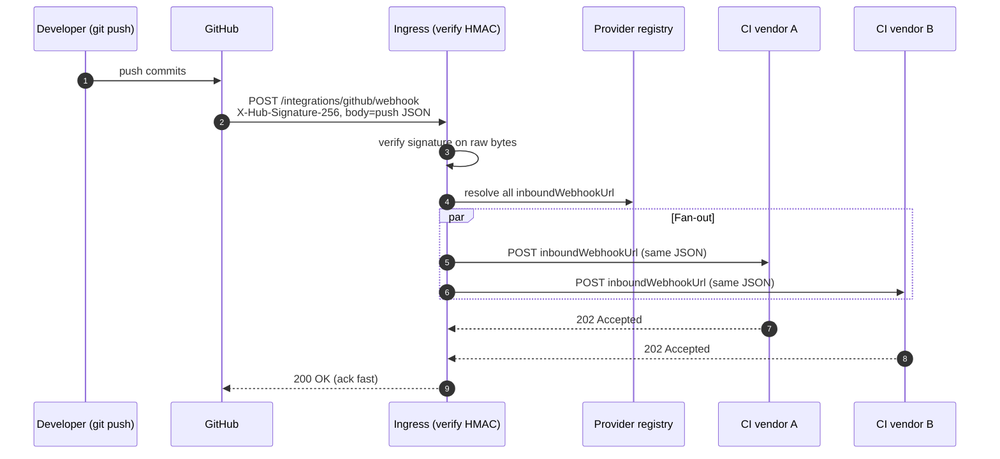
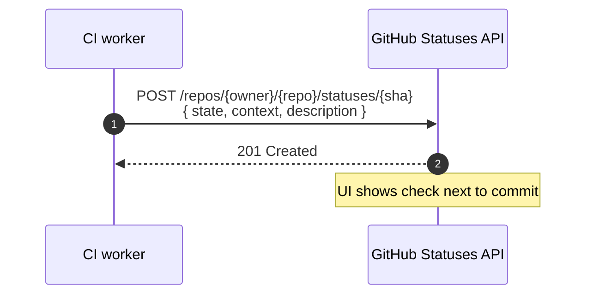
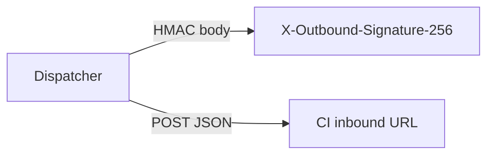
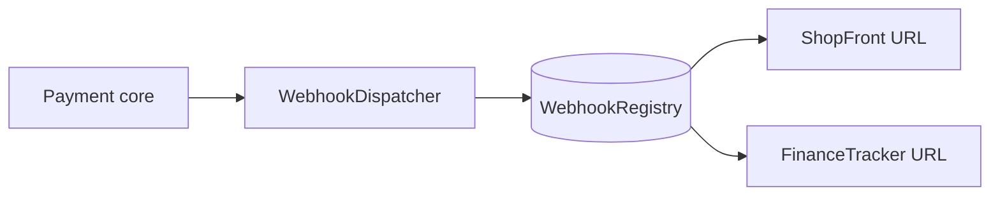

# Diagrams — Webhook architecture

**Note:** All diagrams use **Mermaid** so they render in GitHub and common editors.

---

## 1. GitHub `push` → multiple CI providers (fan-out)

Models **one ingress** that forwards the same verified payload to every registered pipeline URL — how you keep the
core small while onboarding many vendors.

---

## 2. CI → commit status (REST, not inbound webhook)

After the pipeline runs, the CI worker updates the commit using GitHub’s **Statuses** API. This is the usual “green
check” path.

In `implementation/`, `FakeGitHubStatusesController` plays the role of GitHub so you can run the loop locally.

---

## 3. Optional outbound signing to CI

If a CI vendor supports a shared secret on **their** inbound hook, your dispatcher can add `X-Outbound-Signature-256`
the same way GitHub signs to you.

---

## 4. Payment gateway (parallel track, plain Java `after/`)

Same structural idea: registry + signed POST + independent consumers.

