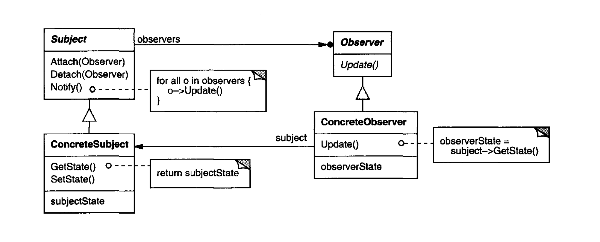

# Observer Pattern

###### Category: Behavioral Pattern

## 1. Intent

Define a **one-to-many** relationship so that when one object’s state or an important event occurs, **all interested
parties** are told about it and can update or react—**without** the “source” object knowing their concrete types or how
many of them exist.

In the classic text, the same idea is often named **Dependents** or described as **Publish–Subscribe**: the subject 
**publishes** a change; observers **subscribe** to that stream of notifications.

---

## 2. Why it exists (the real pain)

Most real systems are not a single class. A fact changes in one place (an order is placed, a document is saved, a price
is updated), and **several** subsystems need to stay in step: email, stock, analytics, another screen, a cache, and
whatever product adds next quarter.

The tempting shortcut is to **call everything inline** from the method that performs the action: send mail, decrement
inventory, log metrics, … It feels fast until each new requirement means **opening that same method again**. The class
grows, merge conflicts multiply, tests become brittle, and the core flow is buried under an ever-growing list of side
effects.

What you actually want is **loose coupling**: the component that completes the business action should **announce** “this
happened,” and everything that cares should **hook into that announcement**—without hard-wiring names and dependencies
inside the core.

**Note:** The classic Observer pattern is a broadcast, “no implied order, no implied pipeline” model.
If Observer B’s work must not start until Observer A has fully finished, you are no longer in the “independent
reactions to the same event” sweet spot—Observer alone is a weak fit unless you add extra rules on top (ordering,
stages, or a different architecture).

---

## 3. What it is (in one breath)

The **Subject** (or publisher) tracks **Observers** (subscribers). When something meaningful happens, the subject 
**notifies** its observers. Each observer implements a small contract (e.g. “something changed—react”). New observers can
be **attached or detached** without rewriting the subject’s core logic.

---

## 4. Structure (classic roles)

| Role                 | Responsibility                                                                                                              |
|----------------------|-----------------------------------------------------------------------------------------------------------------------------|
| **Subject**          | Knows its observers; supports **attach** / **detach**; declares how notification works.                                     |
| **Observer**         | Defines the **update** (or equivalent) interface for objects that must react to subject changes.                            |
| **ConcreteSubject**  | Holds state others care about; **notifies** observers when that state changes in a relevant way.                            |
| **ConcreteObserver** | Implements the reaction; often holds a reference to the subject and **synchronizes** local state or triggers a side effect. |

<p align="center">
  
</p>

<p align="center">
(This image is taken from Design Patterns Elements of Reusable Object-Oriented Software)
</p>

**Flow (simplified):** something causes the subject’s state to change → subject calls `notify` → each registered
observer runs its update. *Who* called the initial change (user code, another object) is secondary; **notify** might be
invoked from the subject after a mutation, or in some designs from elsewhere—what matters is the contract: observers get
a chance to stay consistent.

---

## 5. Applicability (when to reach for it)

Use Observer when:

- **One abstraction has two aspects**—one dependent on the other—and you want to vary or reuse them separately.
- A change in **one** object must ripple to **others**, and you **do not know in advance** how many, or which teams will
  add listeners later.
- An object must **broadcast** “something happened” **without assuming** who receives it—no fixed list of collaborators
  in the source code.

Avoid it (or simplify) when:

- A **single callback** or a **direct service call** is enough.
- **Strict ordering** between reactions is subtle and load-bearing; Observer alone does not spell out order—your
  platform must (ordering API, pipelines, sagas).
- Observers must **coordinate with each other** as a choreography; **that is often better modeled explicitly (workflow,
  messaging, orchestration).** as we say

---

## 6. Consequences (benefits and sharp edges)

**Benefits**

- **Abstract coupling:** the subject knows only a list of `Observer`-shaped objects, not concrete classes—easy to swap
  and test.
- **Open/Closed:** add a new observer type without editing the subject’s notification list to name every class—you
  register instances instead.
- **Broadcast:** one notification can reach **any** number of subscribers; the subject does not encode “how many.”
- **Layering:** a low-level subject can inform higher-level observers without merging layers into one blob.

**Liabilities**

- **Update cascades:** one innocent-looking change can trigger many observers and *their* downstream work. Cost can be
  surprising if discipline is missing.
- **“What changed?”** If the protocol only says “update!” observers may **guess**, over-fetch, or mis-sync. Richer
  events (payloads, change descriptions) or queries back to the subject help—at the cost of a slightly richer contract.
- **Ordering and errors:** unless you define it, listener order is not your business guarantee; failure in one observer
  may affect others depending on framework and threading.

---

## 7. Mapping to this workshop

| Folder            | What to study                                                                                         |
|-------------------|-------------------------------------------------------------------------------------------------------|
| `before/`         | Core logic tangled with side effects (God-method smell).                                              |
| `after/`          | Classic Observer: subject + interface + concrete observers.                                           |
| `spring-example/` | Spring’s `ApplicationEventPublisher` + `@EventListener`: framework-managed subscription and dispatch. |
| `exercise/`       | Practice scenarios—go implement without peeking at full solutions.                                    |

---

## 8. Where you meet Observer in the wild

- **GUI:** model–view separation; widgets subscribing to model changes.
- **Event buses** and **message topics** in larger architectures (cousins of the same idea).
- **Spring:** application events, domain events, integration flows built on listeners.

Not every “something happened” needs Observer. If `TaxCalculator` always applies a fixed rate with no subscribers, a
plain method is fine:

```
class TaxCalculator {
  public double calculateTax(double price) {
    return price * 0.2;
  }
}
```

Use Observer when **multiple independent reactions** to the **same fact** are normal and **expected to grow**.

---

## 9. Problem statement

See **`problem.md`** for the workshop scenario (read it before diving into `before/` and `after/`).
