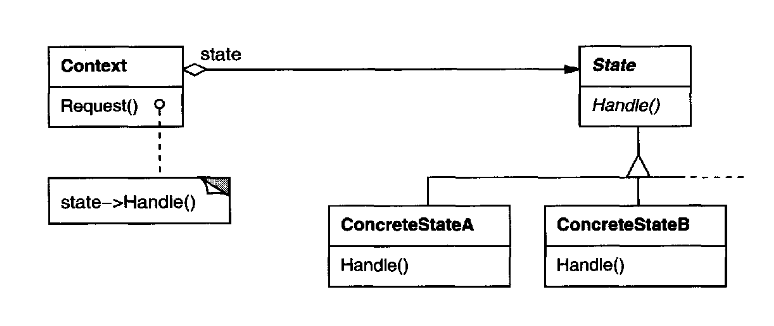

# State Pattern

###### Category: Behavioral Pattern

## 1. Intent

Allow an object to **alter its behavior** when its **internal state** changes. The object will appear to change its
class.

The pattern is also known as **Objects for States**

---

## 2. The problem

When behavior depends heavily on **where an object is in a lifecycle** (open, listening, established, closed, …), code
often devolves into **the same state variable** checked in **many** methods:

```java
switch(phase){
        case CLOSED:...
        case LISTEN:...
        case ESTABLISHED:...
        }
```

That repeats in `open`, `send`, `close`, `transmit`, and so on. Adding a phase or changing a transition means **editing
many methods** and risks inconsistent rules.

See **`problem.md`** for the workshop scenario (simplified TCP-style connection).

---

## 3. State pattern solution

Introduce a **State** abstraction (interface or abstract class) that mirrors the operations the **Context** exposes to
clients. Each **ConcreteState** implements only the behavior valid for that phase and decides **when** to transition to
another state (often by asking the context to replace its current state object).

**Structure (classic):** Client → **Context** → holds current **State** → **ConcreteState** subclasses.

**This workshop:** `TCPConnection` (context) delegates to `TCPState`; `TCPClosed`, `TCPListen`, `TCPEstablished` are
concrete states. Shared stateless state objects act like **flyweights** (one instance per phase type).

---

## 4. Pattern structure

###### Figure is from the design pattern book.

<p align="center">
  
</p>

| Role              | Responsibility                                                                                    |
|-------------------|---------------------------------------------------------------------------------------------------|
| **Context**       | Defines the API clients use; holds a reference to the current `State`; forwards requests to it.   |
| **State**         | Declares behavior associated with a phase of the context; default operations can be no-ops.       |
| **ConcreteState** | Implements behavior for one phase; may call back on the context to read data or **change state**. |

**Collaborations**

- The context **delegates** state-dependent requests to the current state object.
- The context often passes **`this`** so the state can access the context or trigger a transition.
- Either the **context** or the **concrete states** can own transition rules; this sample follows the common style where
  states call a `changeState`-style operation on the context after doing their work.

---

## 5. Mapping to this workshop

| Location    | What to study                                                                                 |
|-------------|-----------------------------------------------------------------------------------------------|
| `before/`   | One class + `enum` phase: **large `switch`** on phase in several methods (`TCPConnection`).   |
| `after/`    | Packaged State pattern: `context/`, `state/`, `state/concrete/`, plus `App.java` entry point. |
| `exercise/` | Hands-on tasks—see **`exercise/README.md`**.                                                  |

**Run the refactored sample** (from `after/`):

```bash
mkdir -p out
javac -d out com/workshop/tcp/context/*.java com/workshop/tcp/state/*.java com/workshop/tcp/state/concrete/*.java com/workshop/tcp/App.java
java -cp out com.workshop.tcp.App
```

---

## 6. State vs Strategy (same shape, different intent)

Both patterns use **composition**: a context holds a polymorphic object and **delegates** work to it. The class diagram
can look similar (context + abstract operation + concrete implementations). The difference is mainly **intent** and
**who controls change over time**.

|                                      | **Strategy**                                                                                 | **State**                                                                                                              |
|--------------------------------------|----------------------------------------------------------------------------------------------|------------------------------------------------------------------------------------------------------------------------|
| **What varies**                      | A **family of algorithms** (how to pay, how to sort, how to compress).                       | **Phase-dependent behavior** (what “open” means when closed vs when already open).                                     |
| **Typical driver of change**         | The **client** or context **configures** which strategy is active (often once per use case). | **The object itself** (via states) **moves through** a lifecycle; the active delegate **changes as transitions fire**. |
| **Transitions**                      | Switching strategy is a **configuration** decision, not usually modeled as a protocol graph. | **Transitions** between concrete states are central; they model **valid steps** in a protocol or workflow.             |
| **Operations on the abstraction**    | Often **one** main method (e.g. `pay`, `compare`) or a small, stable set.                    | Often **many** operations on the context, each with different **per-state** behavior (some no-ops).                    |
| **Concrete classes know each other** | Strategies ideally **do not** depend on sibling strategies.                                  | Concrete states **often** know **successor** states to express allowed transitions.                                    |

**Rule of thumb:** If the object’s “mode” is really a **lifecycle** with rules like “from A only X leads to B,” **State
**
fits well. If you only need to **plug in** a swappable algorithm and the object does not own a rich internal phase
graph, **Strategy** is usually the clearer name.

---

## 7. Benefits

- **Localizes** phase-specific behavior in dedicated classes instead of scattering `switch`/`if` chains.
- Makes **transitions** explicit (replace the state reference) instead of implicit field twiddling.
- **Stateless** concrete states can be **shared** (singleton instances per type), reducing allocation.

---

## 8. Drawbacks

- **More classes** than a single context with a big `switch`.
- Concrete states that choose successors can create **dependencies** between state classes (trade-off for decentralized
  transition logic).
- If over-applied to a tiny problem, the structure can feel heavier than a short enum.

---

## 9. Real-world examples

- Network connection and session handling (the classic TCP-style illustration in *Design Patterns*).
- UI **wizards** and **document editors** (tool/mode changes behavior by internal state).
- Game AI **modes** (patrol, chase, flee) as explicit states.
- Order or ticket **workflows** where operations are only legal in certain statuses.

**In frameworks:** workflow engines, state machines, and protocol handlers often use State-like structures (sometimes
table-driven instead of polymorphic).

---

## 10. Example where State is not needed

If behavior does not depend on a **lifecycle phase** and a single short method suffices, a pattern is unnecessary:

```java
class Greeter {
    String greet(String name) {
        return "Hello, " + name;
    }
}
```

Use State when **many operations** depend on **the same phase variable** and that logic is becoming **unmaintainable**.
