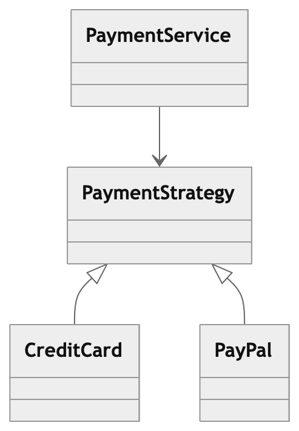

# Strategy Pattern

###### Category: Behavioral Pattern

## 1. Intent

The Strategy Pattern allows you to define a family of algorithms,
encapsulate each one, and make them interchangeable.

It lets the algorithm vary independently of the clients that use it.

---

## 2. The Problem

Imagine a payment system supporting multiple payment methods (is simple and good example to understand):

- Credit Card
- PayPal
- Crypto

A naive implementation might look like:

```
public void pay(String type, double amount) {
    if (type.equals("card")) {
    ...
    } else if (type.equals("paypal")) {
    ...
    } else if (type.equals("crypto")) {
    ...
    }
}
```

Problems with this design:

- Violates Open/Closed Principle
- Difficult to extend
- Large conditional logic
- Tight coupling
- Also with this implementing a new feature requires you to change the same huge class,
  conflicting with the code produced by other people, and take too much time to resolving merge conflicts...

---

## 3. Strategy Pattern Solution

Instead of conditional logic, we encapsulate behavior into separate classes.

**Structure:** Client → Context → Strategy Interface → Concrete Strategies

**Example:** PaymentService → PaymentStrategy → CreditCardPayment / PaypalPayment

---

## 4. Pattern Structure

### Components:

**Strategy**

Defines a common interface for all algorithms.

**Concrete Strategy**

Implements the algorithm.

**Context**

Uses a strategy object to perform the operation. Uses that interface without knowing which 
implementation it is using.

# 5. UML Concept

<p align="center">
  
</p>

---

## 6. Benefits

- Eliminates large conditional statements
- Promotes Open/Closed Principle
- Encourages composition over inheritance
- Algorithms become reusable

---

## 7. Drawbacks

- More classes
- Slight increase in complexity for simple logic

---

## 8. Real-World Examples

**Strategy Pattern appears in many systems:**

- Sorting algorithms
- Compression algorithms
- Authentication providers
- Payment processing systems

**In Spring:**

Authentication providers  
Message converters  
Handler mappings

### Example where Strategy is NOT needed:
```
class TaxCalculator {
  public double calculateTax(double price) {
    return price * 0.2;
  }
}
```
